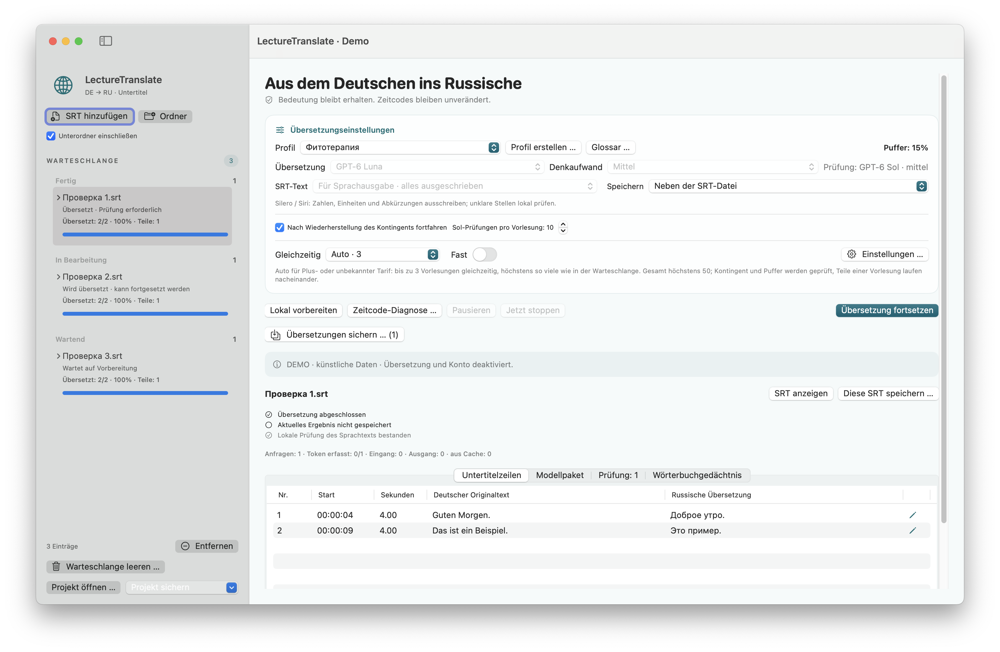

# LectureTranslate


**Deutsch** · [Русский](docs/ru/README.md) · [English](docs/en/README.md)

[LectureTranslate 3.5.1 herunterladen](https://github.com/popovantondev/LectureTranslate/releases/latest)

**Aktueller Release: 3.5.1 · Build 16.** Prüfen Sie vor dem Download die Release-Notizen und SHA-256-Prüfsummen. Frühere Releases bleiben im GitHub-Archiv verfügbar.

LectureTranslate ist eine native macOS-App zum Übersetzen deutscher Vorlesungsuntertitel (`.srt`) ins Russische. Cue-IDs und Zeitcodes bleiben erhalten. Die App bietet eine fortsetzbare Warteschlange, lokale Prüfhinweise und kontrollierten Export als `name.ru.srt`.

**System:** macOS 15 oder neuer, Apple Silicon (arm64). Übersetzung und Review benötigen eine separate Verbindung und Anmeldung beim externen Übersetzungsdienst. Einrichtung: [Build und Verbindung](docs/de/BUILD.md). FFmpeg/ffprobe sind optional und nur für bestimmte lokale Audio-/Videofunktionen erforderlich.

## Status

Die Oberfläche ist auf Deutsch, Russisch und Englisch verfügbar. Die lokale Offline-Suite bestand **2473 Prüfungen einschließlich 14 Release-Validierungen**; dazu kamen isolierte GUI-Prüfungen mit synthetischen Daten. Das belegt keine medizinische Übersetzungsqualität und keine Geschwindigkeit von 50 echten parallelen Übersetzungsanfragen.

## Dokumentation

- [Benutzerhandbuch auf Deutsch](docs/de/README.md)
- [Руководство пользователя на русском](docs/ru/README.md)
- [User guide in English](docs/en/README.md)
- [Build und lokale Tests auf Deutsch](docs/de/BUILD.md)
- [Änderungen auf Deutsch](docs/de/CHANGELOG.md)
- [Rechte und erlaubte Nutzung](docs/de/RIGHTS.md)
- [Drittanbieterhinweise auf Deutsch](docs/de/THIRD-PARTY-NOTICES.md)

## Schnellstart

1. Deutsche SRT-Dateien oder einen Ordner hinzufügen.
2. Übersetzungsprofil, Textausgabe und Speicherort auswählen.
3. Übersetzung starten. Fertige Ergebnisse werden im Verlauf der Warteschlange gesichert; die Warteschlange kann pausiert und fortgesetzt werden.

Zuerst entsteht ein Übersetzungsentwurf; ausgewählte Risikostellen werden anschließend geprüft. Ein gespeichertes SRT mit offenen Hinweisen ist dadurch nicht fachlich bestätigt. Namen, unklare Erkennung, Mengenangaben und medizinische Aussagen am deutschen Original und bei Bedarf am Video prüfen.

## Screenshot



Dies ist ein synthetischer Demo-Screenshot. Modellzugriff und Kontozugriff sind deaktiviert.

## Daten und Datenschutz

Warteschlange, Übersetzungsjournale, Nutzungsprotokolle und Begriffssammlung liegen lokal unter `~/Library/Application Support/LectureTranslator2/`. Ein `.lectureproject` kann Untertiteltexte, Übersetzungen, Notizen und lokale Dateipfade enthalten; Medien und Zugangsdaten des Übersetzungsdienstes werden nicht eingepackt. Projekte und lokaler Zustand sind vertraulich zu behandeln.

Übersetzungs- und Review-Texte werden über die angemeldete Verbindung an den externen Dienst übermittelt. Build, Offline-Tests und Demo-Funktionen benötigen keine Anmeldung und senden keine Übersetzungsanfragen. Keine echten Vorlesungen, Projektarchive, Logs, Zugangsdaten, persönlichen Pfade oder privaten Screenshots in öffentliche Issues hochladen.

## Lokal bauen und testen

Voraussetzungen: macOS 15+, Apple Command Line Tools, Bash und Ruby. Im Projektverzeichnis:

```sh
bash Scripts/test-all.sh
bash Scripts/build.sh --preview
```

Die lokalen Offline-Tests bestanden 2473 Prüfungen einschließlich 14 Release-Validierungen. Zwölf synthetische GUI-Hauptfenster (DE/RU/EN, hell/dunkel, kompakt/groß) sowie Startbildschirm und Menüs wurden geprüft; nicht jeder einzelne Dialog wurde durchgespielt. Das veröffentlichte Paket [3.5.1 · Build 16](https://github.com/popovantondev/LectureTranslate/releases/tag/v3.5.1) ist verfügbar. Preview-Builds bleiben davon getrennte Testpakete. Weitere Einzelheiten: [Build und lokale Tests](docs/de/BUILD.md).

## Rechte und Drittanbieter

Für den ursprünglichen Quellcode wird keine Open-Source-Lizenz erteilt. Öffentliche Sichtbarkeit ist keine Erlaubnis, den Quellcode oder abgeleitete Versionen außerhalb der GitHub-Plattform zu kopieren, zu ändern, weiterzuverbreiten oder zu verkaufen. Das Herunterladen und Ausführen eines unveränderten Release-Binaries ist für den persönlichen Gebrauch gestattet. Details: [Rechte und erlaubte Nutzung](docs/de/RIGHTS.md) sowie [Drittanbieterhinweise](docs/de/THIRD-PARTY-NOTICES.md).

Das veröffentlichte ZIP enthält keine Developer ID-Signatur und keine Apple-Notarisierung; macOS kann beim ersten Öffnen warnen. Die Hinweise zu eigenem Code gewähren keine Rechte an Vorlesungsmaterial, externen Diensten oder optionalen FFmpeg-Builds.
