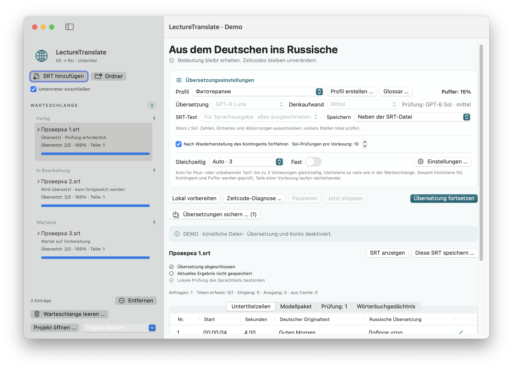
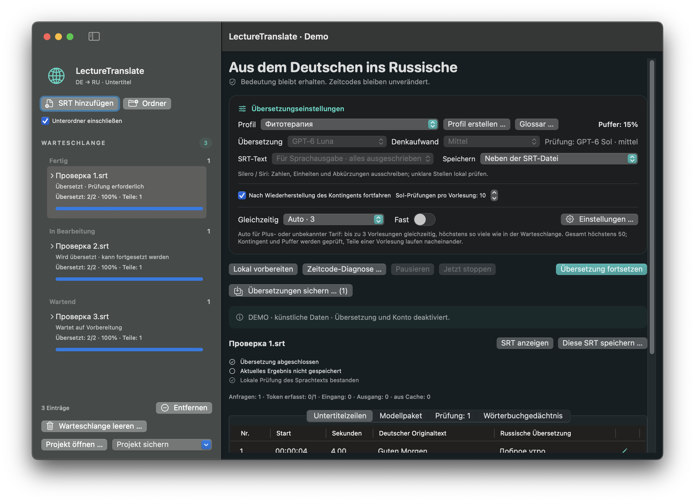
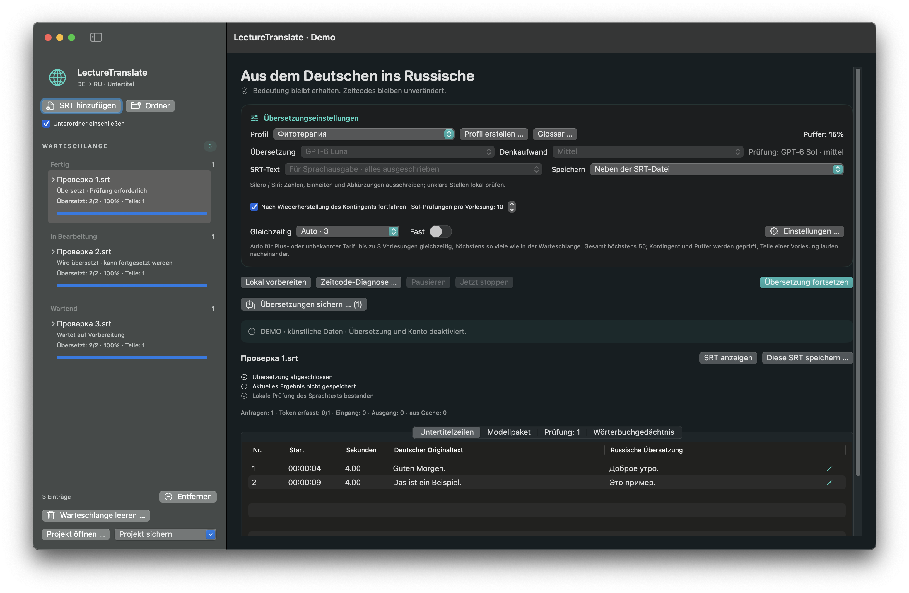

# LectureTranslate · Benutzerhandbuch

[Deutsch](README.md) · [Russisch](../ru/README.md) · [Englisch](../en/README.md) · [Zur Projektübersicht](../../README.md)

**Version 3.5.1 · Build 16.** Der lokale Release-Kandidat wurde mit synthetischen Daten und isolierten GUI-Szenarien geprüft. Ein Download wird auf der Projektübersicht verlinkt, sobald das geprüfte GitHub-Release veröffentlicht ist.

LectureTranslate ist eine native macOS-App zum Übersetzen deutscher Vorlesungsuntertitel (`.srt`) ins Russische. Cue-IDs und Zeitcodes bleiben erhalten. Die App bietet eine pausierbare Warteschlange, lokale Prüfhinweise und Export als `name.ru.srt`.

**Voraussetzungen:** macOS 15 oder neuer auf Apple Silicon (arm64). Übersetzung und Review benötigen ein lokal installiertes Codex CLI mit ChatGPT-Anmeldung. Die App verwendet keinen OpenAI-API-Schlüssel und keine separat abgerechnete API. FFmpeg/ffprobe sind optional und nur für bestimmte lokale Medienfunktionen erforderlich.

## Screenshots

Die Beispiele verwenden ausschließlich synthetische Daten; Modellanfragen und Kontozugriff sind im Demo-Modus deaktiviert.

| Helles Design · kompakt | Helles Design · groß |
|---|---|
|  |  |

| Dunkles Design · kompakt | Dunkles Design · groß |
|---|---|
|  |  |

## Übersetzen

1. Eine deutsche `.srt`-Datei oder einen Ordner mit Untertiteln hinzufügen.
2. Profil, Textausgabe und Speicherort auswählen.
3. Die Warteschlange starten. Fertige Antworten werden während der Arbeit gesichert; die Warteschlange lässt sich pausieren und fortsetzen.

Standardmäßig erstellt GPT-6 Luna Medium den Übersetzungsentwurf; GPT-6 Sol Medium prüft ausgewählte Risikostellen. Teile derselben Vorlesung werden nacheinander verarbeitet. Verschiedene Vorlesungen können parallel laufen. Unbekannte oder veraltete Kontingentdaten geben keine neuen Modellanfragen frei; der gemeinsame Höchstwert beträgt 50.

## Prüfen und speichern

Cue-IDs und Zeitcodes sollen aus dem deutschen Original erhalten bleiben. Das normale Ergebnis ist eine UTF-8-SRT-Datei mit dem Suffix `.ru.srt`. Vor dem Speichern Ziele und Bestätigung zum Ersetzen vorhandener Dateien prüfen. Projektdateien können zusätzlich Warteschlange, Übersetzungen und lokale Notizen sichern.

„Übersetzt“, „gespeichert“ und „für Sprachsynthese geprüft“ sind getrennte Zustände. Ein Export mit offenen Hinweisen bestätigt weder Übersetzungsqualität noch Aussprache. Namen, unklare Erkennung, Zahlen, Einheiten, Dosierungen, Negationen und medizinische Aussagen mit dem deutschen Original abgleichen. Lokale Prüfungen können Auffälligkeiten markieren, garantieren aber keine korrekte Aussprache in Silero oder Siri.

Für Silero / Kseniya den Sprachmodus wählen, sofern verfügbar: Zahlen, Einheiten und eindeutige Abkürzungen sollen ausgeschrieben werden. Schwierige Fachbegriffe nicht vereinfachen oder erraten; unklare Erkennung anhand der Quelle klären. Aussprachemarkierungen gehören nicht ins sichtbare SRT.

## Kontingent, Pause und Fortsetzung

Kontingentdaten werden über die angemeldete Codex-Umgebung gelesen; API-Kosten zeigt die App nicht an. Der Reservewert ist ein Schutz, keine exakte Garantie, weil laufende Anfragen weiter Kontingent verbrauchen. Keine zweite App-Kopie zum Umgehen von Grenzen starten.

Eine manuelle Pause hat Vorrang vor automatischer Fortsetzung. Nach einer Unterbrechung den gespeicherten Stand öffnen und die Warteschlange fortsetzen; bereits abgeschlossene gespeicherte Antworten sollen nicht erneut angefordert werden. Bei fehlenden, veralteten oder ungültigen Kontingentdaten keine neuen Modellanfragen starten.

## Video und lokale Daten

Wenn ein lokales Video mit einem Hinweis verknüpft ist, kann die App einen Ausschnitt in der Nähe der betreffenden Stelle öffnen. Verfügbarkeit und Formate hängen von der Datei und den installierten Hilfsprogrammen ab. Ein fehlendes gespeichertes Video darf nicht still durch eine ähnlich benannte Datei ersetzt werden.

Warteschlange, Journale, Nutzungsdaten und Begriffssammlung liegen lokal unter `~/Library/Application Support/LectureTranslator2/`. Projektdateien können Untertiteltexte, Übersetzungen, Notizen und lokale Pfade enthalten; Medien und Codex-Anmeldedaten werden nicht automatisch eingepackt. Diese Dateien vertraulich behandeln.

## Datenschutz und Rechte

Übersetzungs- und Review-Texte werden über das angemeldete Codex CLI an den Dienst übermittelt. Keine echten Vorlesungen, Projektarchive, Logs, Zugangsdaten, persönlichen Pfade oder privaten Screenshots in öffentliche Issues hochladen. Für den Quellcode wird keine offene Lizenz erteilt; ein unverändertes Release-Binary darf persönlich genutzt werden. Details: [Rechte](RIGHTS.md) und [Drittanbieterhinweise](THIRD-PARTY-NOTICES.md).

## Weitere Informationen

[Build und Tests](BUILD.md) · [Änderungen](CHANGELOG.md) · [Rechte](RIGHTS.md) · [Drittanbieterhinweise](THIRD-PARTY-NOTICES.md)
