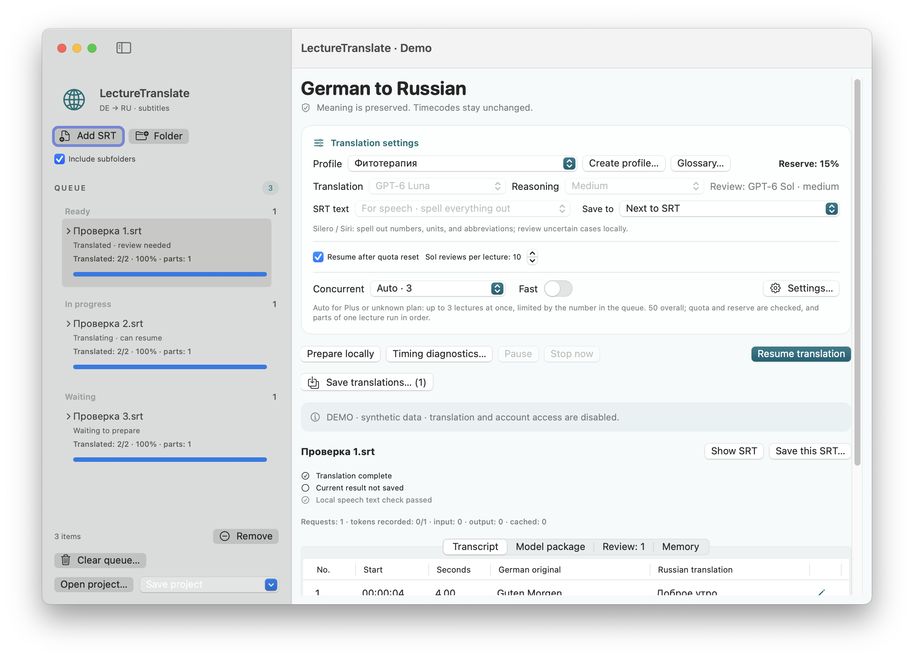
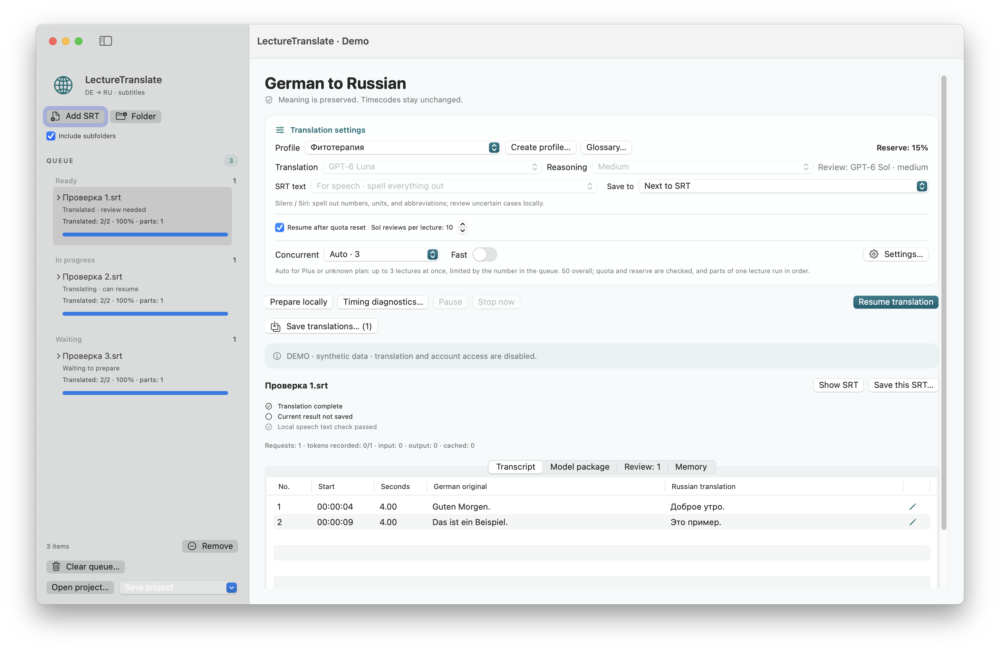
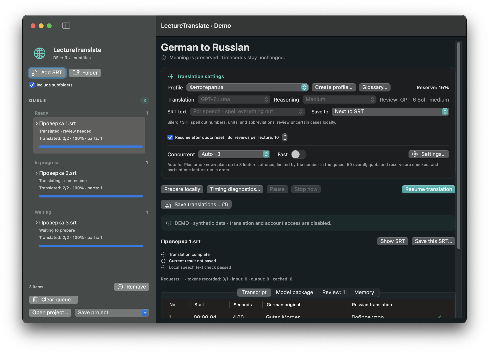
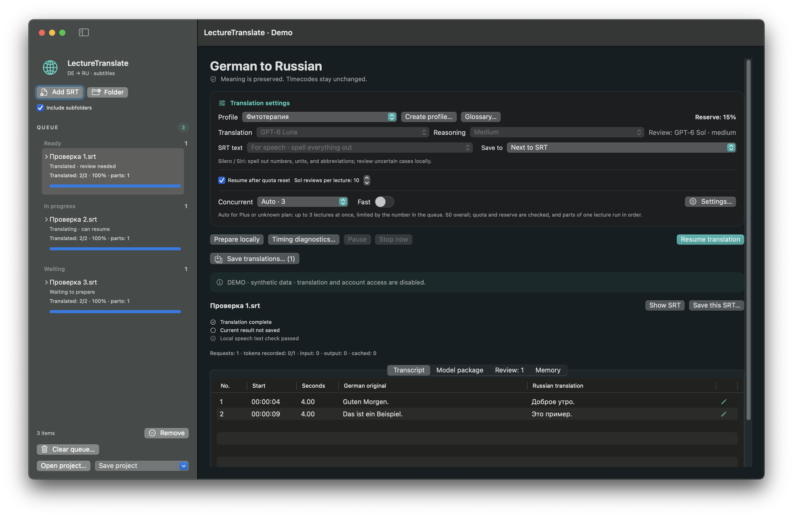

# LectureTranslate · User guide

[German](../de/README.md) · [Russian](../ru/README.md) · [English](README.md)

**Version 3.5.1 · build 16.** The local release candidate was checked with synthetic data and isolated GUI scenarios. A download link will appear on the project overview after the verified GitHub release is published.

LectureTranslate is a native macOS app for translating German lecture subtitles (`.srt`) into Russian. Cue IDs and timecodes are preserved. It provides a pausable, resumable queue, local review notes, and export as `name.ru.srt`.

**Requirements:** macOS 15 or later on Apple Silicon (arm64). Translation and review require the Codex CLI installed locally and signed in with ChatGPT. The app does not use an OpenAI API key or a separately billed API. FFmpeg/ffprobe are optional for specific local media features.

## Screenshots

These screenshots use synthetic data only; model requests and account access are disabled in demo mode.

| Light theme · compact window | Light theme · large window |
|---|---|
|  |  |

| Dark theme · compact window | Dark theme · large window |
|---|---|
|  |  |

## Translate

1. Add a German `.srt` file or a folder of subtitle files.
2. Choose a profile, text style, and destination.
3. Start the queue. Completed responses are saved as work proceeds; you can pause and resume the queue.

By default, GPT-6 Luna Medium creates translation drafts and GPT-6 Sol Medium reviews selected risk areas. Parts of one lecture are processed in order; different lectures may run concurrently. Unknown or stale quota data does not authorize new model requests. The shared maximum is 50.

## Review and save

Cue IDs and timecodes should be preserved from the German source. The normal output is a UTF-8 SRT with the `.ru.srt` suffix. Check the destination and any overwrite confirmation before saving. A project can also store the queue, translations, and local notes.

“Translated,” “saved,” and “checked for speech synthesis” are separate states. Exporting with unresolved notes does not certify translation quality or pronunciation. Check names, unclear recognition, numbers, units, doses, negations, and medical statements against the German source. Local checks can flag suspicious characters, but cannot guarantee correct pronunciation by Silero or Siri.

For Silero / Kseniya, choose the speech-oriented text mode when available: numbers, units, and unambiguous abbreviations are intended to be spelled out. Do not simplify or guess complex terms; resolve unclear recognition against the source. Pronunciation marks for the speech engine do not belong in displayed subtitles.

## Quotas, pause, and resume

Quota information is read through the signed-in Codex environment; the app does not calculate API costs. The reserve is a safeguard, not an exact guarantee, because in-flight requests continue to consume quota. Do not start another app copy to bypass service limits.

A manual pause takes precedence over automatic continuation. After interruption, open the saved state and resume the queue; completed saved responses should not be requested again. If quota data is missing, stale, or invalid, new model requests do not start.

## Video and local data

When a local video is associated with a note, the app may open a segment near the relevant time. Availability depends on the file and installed helper tools. A missing previously selected video must not be silently replaced by a similarly named file.

Queue state, journals, usage records, and terminology are stored locally in `~/Library/Application Support/LectureTranslator2/`. A project may contain subtitle text, translations, notes, and local paths; media and Codex credentials are not automatically included. Treat these files as private.

## Privacy and rights

Translation and review text is sent through the signed-in Codex CLI. Do not attach real lectures, project archives, logs, credentials, personal paths, or private screenshots to public issues. No open-source license is granted for the source code; an unmodified release binary may be used for personal purposes. Details: [rights](RIGHTS.md) and [third-party notices](THIRD-PARTY-NOTICES.md).

## More information

[Build and tests](BUILD.md) · [Changelog](CHANGELOG.md) · [Rights](RIGHTS.md) · [Third-party components](THIRD-PARTY-NOTICES.md)
