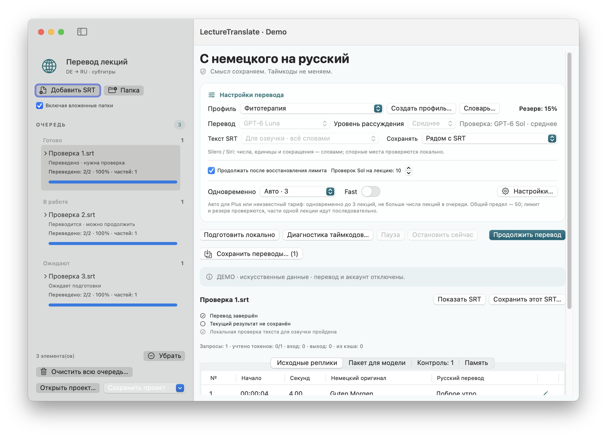
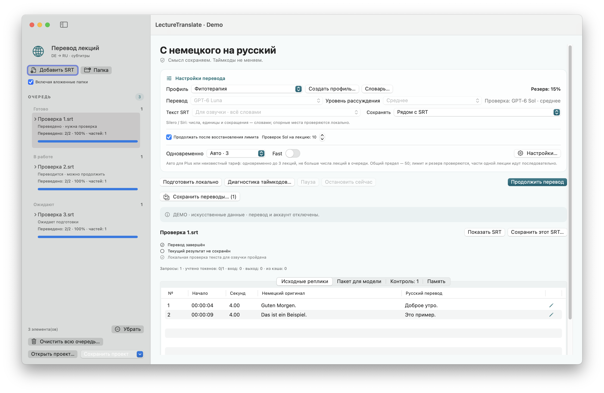
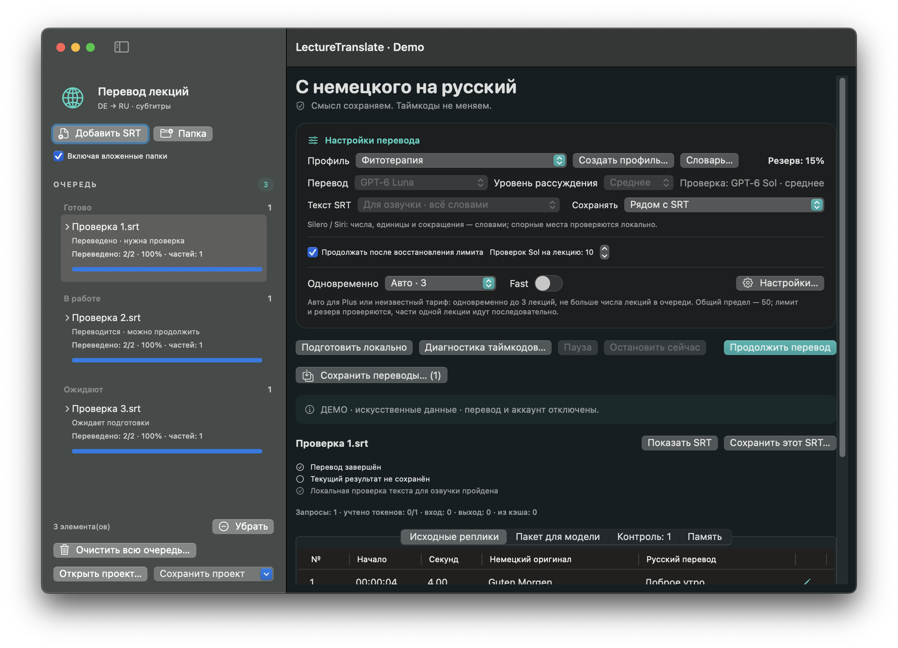
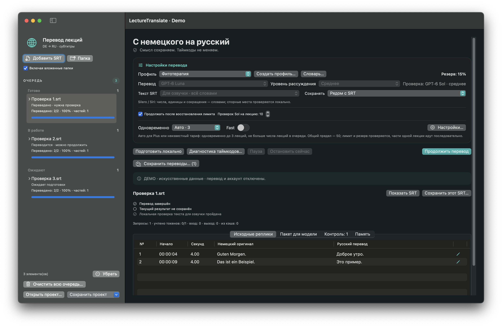

# LectureTranslate · Руководство пользователя

<!-- public-release:start -->
Переводит немецкие SRT-субтитры на русский с сохранением таймкодов, очередью и проверкой черновика.

**macOS 15+ · Apple Silicon · Выпуск 3.5.1**

**[Скачать](https://github.com/popovantondev/LectureTranslate/releases/tag/v3.5.1)** · **[Инструкция](https://popovantondev.github.io/LectureTranslate/Guide-ru.html)** · **[Сообщить об ошибке](https://github.com/popovantondev/LectureTranslate/issues/new/choose)**

**Требования и ограничения:** Нужны отдельное подключение и вход во внешний сервис перевода. FFmpeg/ffprobe необязательны для отдельных медиафункций.

**Первые шаги:** Распакуйте архив приложения, настройте подключение по руководству и добавьте немецкие .srt. Проверяйте перевод перед использованием.

**Файлы приложения:**

- [`lecture_translate-v3.5.1-app.zip`](https://github.com/popovantondev/LectureTranslate/releases/download/v3.5.1/lecture_translate-v3.5.1-app.zip)

**Контрольные суммы:** [`SHA256SUMS`](https://github.com/popovantondev/LectureTranslate/releases/download/v3.5.1/SHA256SUMS)
<!-- public-release:end -->

[Немецкая версия](../de/README.md) · [Русская версия](README.md) · [Английская версия](../en/README.md)

**Версия 3.5.1 · build 16.** Релиз опубликован. Ранее выполненные проверки используют искусственные данные и изолированные GUI-сценарии. [Скачать релиз 3.5.1](https://github.com/popovantondev/LectureTranslate/releases/tag/v3.5.1).

LectureTranslate — нативная программа для macOS, переводящая немецкие субтитры лекций (`.srt`) на русский. ID реплик и таймкоды сохраняются. В программе есть очередь с паузой и продолжением, локальные замечания и экспорт в `название.ru.srt`.

**Требования:** macOS 15 или новее на Apple Silicon (arm64). Для перевода и проверки нужны отдельное подключение и вход во внешний сервис перевода. Настройка: [BUILD.md](BUILD.md). FFmpeg/ffprobe необязательны и нужны лишь для отдельных локальных функций работы с медиа.

## Снимки программы

Используются только искусственные данные; в режиме демонстрации запросы к моделям и доступ к аккаунту отключены.

| Светлая тема · компактное окно | Светлая тема · большое окно |
|---|---|
|  |  |

| Тёмная тема · компактное окно | Тёмная тема · большое окно |
|---|---|
|  |  |

## Перевод

1. Добавьте немецкий файл `.srt` или папку с субтитрами.
2. Выберите профиль, формат текста и место сохранения.
3. Запустите очередь. Готовые ответы сохраняются по ходу работы; очередь можно приостановить и продолжить.

Сначала создаётся черновик перевода, затем проверяются выбранные рискованные места. Части одной лекции обрабатываются последовательно; разные лекции могут переводиться параллельно. Неизвестные или устаревшие сведения о лимите не разрешают новые запросы перевода; общий максимум — 50.

## Проверка и сохранение

ID реплик и таймкоды должны сохраняться из немецкого оригинала. Обычный результат — UTF-8 SRT с окончанием `.ru.srt`. Перед сохранением проверьте папку назначения и подтверждение замены существующего файла. Проект может дополнительно хранить очередь, переводы и локальные заметки.

Статусы «переведено», «сохранено» и «проверено для озвучки» различаются. Экспорт с открытыми замечаниями не подтверждает точность перевода или произношения. Сверяйте с оригиналом имена, неясное распознавание, числа, единицы, дозировки, отрицания и медицинские утверждения. Локальная проверка может отметить подозрительные символы, но не гарантирует правильное произношение в Silero или Siri.

Для Silero / Kseniya выбирайте режим текста для озвучки, если он доступен: числа, единицы и однозначные сокращения должны записываться словами. Не упрощайте и не угадывайте сложные термины; неясную транскрипцию сверяйте с источником. Знаки ударения для синтезатора не вставляются в экранные субтитры.

## Лимиты, пауза и продолжение

Сведения о лимитах программа получает через авторизованное подключение к сервису перевода; API-стоимость не рассчитывается. Резерв — это страховка, а не точная гарантия: уже запущенные запросы продолжают расходовать лимит. Не запускайте копию программы для обхода ограничений.

Ручная пауза важнее автоматического продолжения. После остановки откройте сохранённое состояние и продолжите очередь; готовые сохранённые ответы не должны запрашиваться повторно. Если лимит отсутствует, устарел или недостоверен, новые запросы перевода не запускаются.

## Видео и локальные данные

Если с замечанием связано локальное видео, программа может открыть фрагмент около нужного времени. Доступность зависит от файла и вспомогательных программ. Ранее выбранное видео нельзя незаметно заменять похожим файлом, если оно не найдено.

Очередь, журналы, данные об использовании и словарь хранятся локально в `~/Library/Application Support/LectureTranslator2/`. Проект может содержать тексты субтитров, переводы, заметки и локальные пути; медиа и данные входа в сервис автоматически не включаются. Считайте эти файлы приватными.

## Приватность и права

Текст перевода и проверки передаётся внешнему сервису через авторизованное подключение. Не прикладывайте к публичным обращениям настоящие лекции, проектные архивы, журналы, данные доступа, персональные пути или личные снимки экрана. Открытая лицензия на исходный код не предоставляется; неизменённый релизный бинарник разрешено использовать лично. Подробности: [права](RIGHTS.md) и [уведомления о сторонних компонентах](THIRD-PARTY-NOTICES.md).

## Дополнительно

[Сборка и тесты](BUILD.md) · [История изменений](CHANGELOG.md) · [Права](RIGHTS.md) · [Сторонние компоненты](THIRD-PARTY-NOTICES.md)
